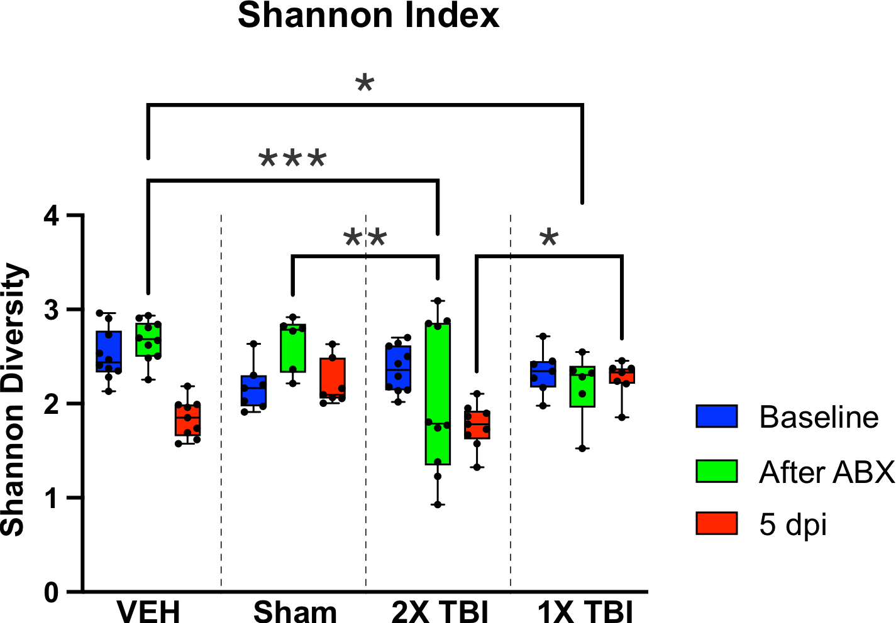
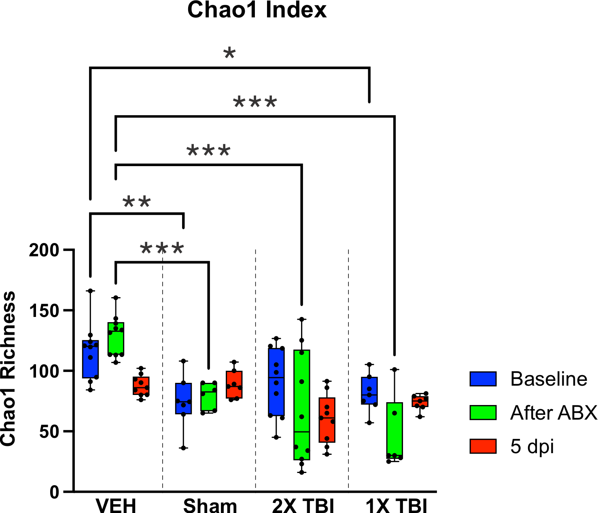
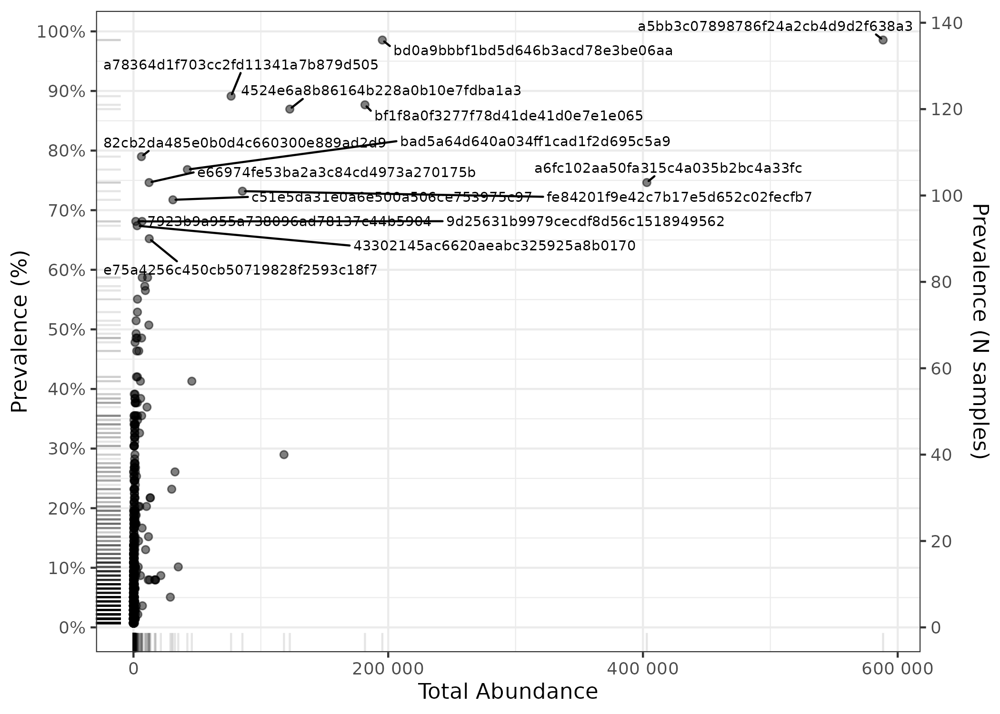
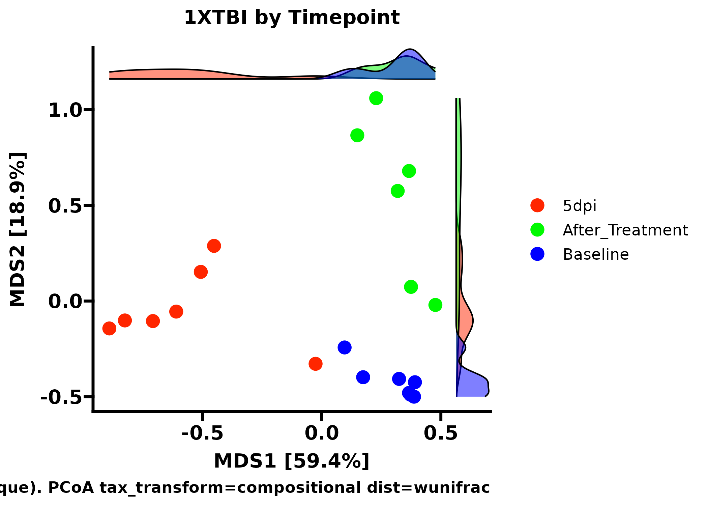
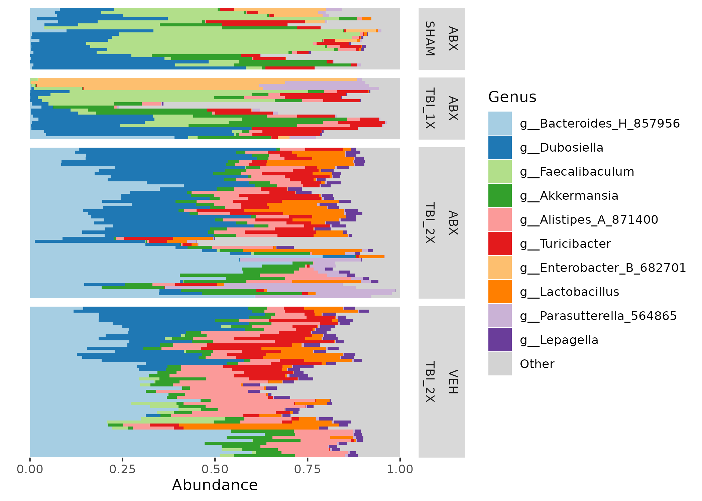
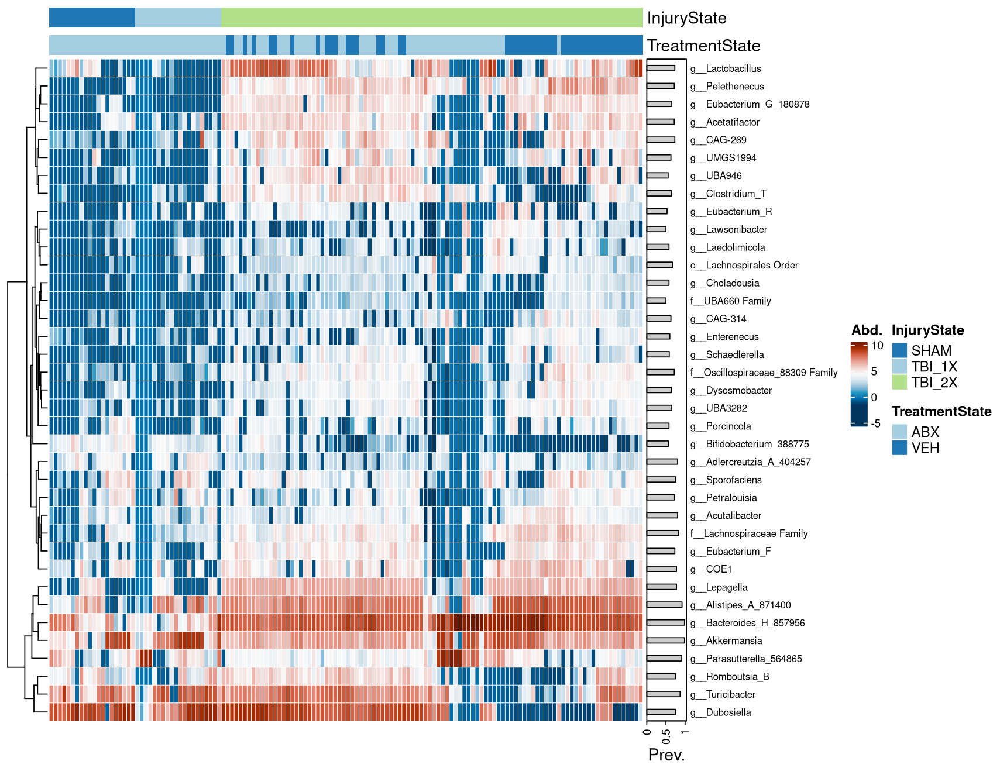
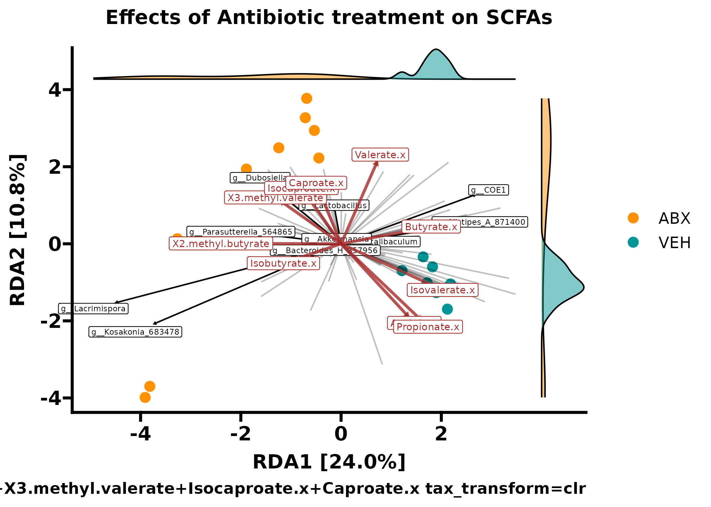
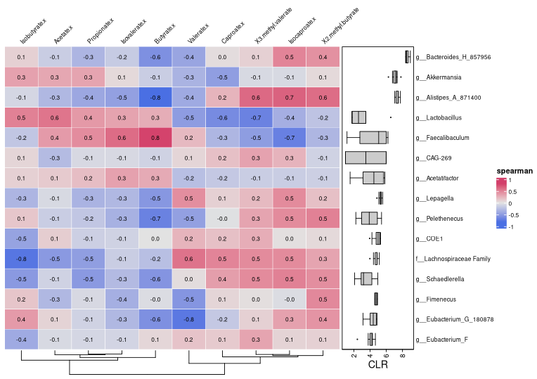
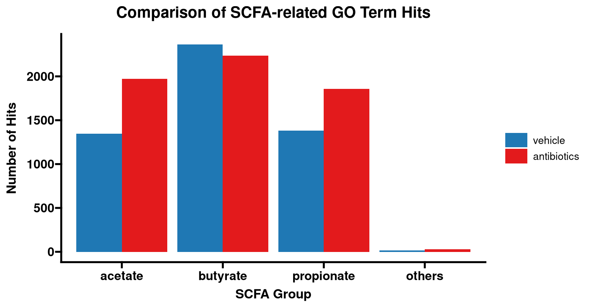

## Introduction

This vignette contains all of the code necessary for the microbiome analysis within our paper named "Antibiotic treatment induces microbiome dysbiosis and reduction of neuroinflammation following traumatic brain injury in mice". In this study, we researched the relationship between antibiotics, traumatic brain injury, and the gut microbiome. The gut microbiome analysis of this study was performed through short-read 16S V1-V3 sequencing performed at Baylor College of Medicine with raw fastq data accessible at BioProject [PRJNA1104663](https://www.ncbi.nlm.nih.gov/bioproject/PRJNA1104663).

Much of the data and visualizations here had slight visual touching up in photoshop/coreldraw just to make them look _perf_ prior to submission, so if you see a difference between the figures produced here and those found within our paper that is why.

In the beginning of this markdown, we will perform all the steps needed to process short-read 16S data using [dada2](https://github.com/benjjneb/dada2), with a big shoutout to Dr. Ben Callahan for the beginning chunks of this from [STAMPS 2024 workshop](https://github.com/mblstamps/stamps2024).

## Load dependencies

```{r, eval=FALSE}
library(dada2)
library(dplyr)
library(janitor)
library(biomformat)
library(Biostrings)
library(tibble)
library(digest)
library(phyloseq)
library(microViz)
library(ggplot2)
library(ggprism)
library(ggsci)
library(forcats)
library(FSA)
library(ggsignif)
library(broom)
library(igraph)
library(visNetwork)
library(SpiecEasi)
library(progressr); handlers(global=TRUE)
library(furrr); plan(multisession, workers = 72)
```

## Process fastq data with DADA2

More work similar to this can be found the [DADA2 tutorial](https://benjjneb.github.io/dada2/tutorial.html).

```{r, eval=FALSE}
# Where is the freshly downloaded data?
list.files()
path <- "/condo/neurobiome/tmhagm8/abx_depl/fastq"

# Read in the forward and reverse fastq file names
fnFs <- list.files(path, pattern="_R1_001", full.names=TRUE)
fnRs <- list.files(path, pattern="_R2_001", full.names=TRUE)
head(fnFs)

# Get the qualities of all samples
plotQualityProfile(fnFs)
plotQualityProfile(fnRs)

# Define the paths to filtered files we are going to create
filtFs <- file.path(path, "filtered", basename(fnFs)) 
filtRs <- file.path(path, "filtered", basename(fnRs))

# Perform filtering and trimming
out <- filterAndTrim(fnFs, filtFs, fnRs, filtRs, maxEE=2, 
                     trimLeft=c(17, 21), # REPLACE XXX/YYY with valid parameter choices
                     truncLen=c(275, 265),
                     multithread = TRUE) 
head(out)
```

Plot errors and run DADA2

```{r, eval=FALSE}
# Learn the error model from the filtered data.
errF <- learnErrors(filtFs, multi=TRUE)
errR <- learnErrors(filtRs, multi=TRUE)

# Visualize the error model. Points are observations, black line is fitted error model.`
plotErrors(errF, nominalQ = TRUE)
plotErrors(errR, nominalQ = TRUE)

# Run the DADA2 method using the fitted error model.
ddF <- dada(filtFs, errF, pool=FALSE, multi=TRUE)
ddR <- dada(filtRs, errR, pool=FALSE, multi=TRUE)
```

Merging reads, make sequence table, and remove chimeras

```{r, eval=FALSE}
# Merge the denoised forward and reverse reads together.
mm <- mergePairs(ddF, filtFs, ddR, filtRs, verbose=TRUE)
# Were most reads retained during merging. If not, why not?

# Construct a sequence table: rows are samples, columns are ASVs, values are abundances.
# ASVs (columns) are ordered by their summed abundance across all samples.
sta <- makeSequenceTable(mm)
dim(sta)

# Remove chimeric ASVs and construct a new chimera-free sequence table.
st <- removeBimeraDenovo(sta, multi=TRUE, verbose=TRUE)
sum(st)/sum(sta)
```

Sanity check

```{r, eval=FALSE}
# Code derived from the dada2 tutorial: https://benjjneb.github.io/dada2/tutorial.html
getN <- function(x) sum(getUniques(x))
track <- cbind(out, sapply(ddF, getN), sapply(ddR, getN), sapply(mm, getN), rowSums(st))
colnames(track) <- c("input", "filtered", "denoisedF", "denoisedR", "merged", "nonchim")
rownames(track) <- basename(fnFs)
head(track)
```

Assign taxonomy

```{r, eval=FALSE}
# Assign taxonomy down to the genus level to these 16S ASVs.
tax <- assignTaxonomy(st, "/home/tmhagm8/scratch/dada2/gg2_2024_09_toSpecies_trainset.fa.gz",
                      multi=TRUE)
unname(head(tax)) # unname strips the long ASV rownames to make the printed output more readable
```

Prepare phyloseq inputs

```{r, eval=FALSE}
# Metadata file
samdf <- read.delim("/condo/neurobiome/tmhagm8/abx_depl/abx_depl_dada2_gg2/adult_abx_tbi/data/abx_redo_metadata.tsv",
                    check.names = FALSE, header = TRUE, row.names = 1)

# Change the sample names in st to match metadata
rownames(st) <- gsub("_R1_001\\.fastq\\.gz$", "", rownames(st))
```

Make ASV fasta for phylogenetics

```{r, eval=FALSE}
# lets make our rep-seqs.fasta file to process the ASV's with mafft and fasttree
# In 'dada2', the columns of 'st' are the unique ASV sequences.
seqs <- colnames(st)

# Create a short "ASV name" by MD5 hashing each sequence
asv_ids <- vapply(seqs, digest, FUN.VALUE = character(1), algo = "md5")

# Write out a FASTA file where:
# >asv_id
# SEQUENCE
output_fasta <- "rep-seqs.fasta"
fileConn <- file(output_fasta, "w")

for (i in seq_along(seqs)) {
  # Write a FASTA header (">...") followed by the actual sequence
  cat(">", asv_ids[i], "\n", seqs[i], "\n", sep = "", file = fileConn)
}

close(fileConn)
```


## Run MAFFT & FastTree in CLI

To create the phylogenetic tree of our ASV sequences I turned to using my SLURM HPC and ran the following script with the rep-seqs.fasta file we created above.
I created a conda environment that had MAFFT and FastTree installed to run this.

```{r, engine = 'bash', eval = FALSE}
#! /bin/bash

#SBATCH --time=04-00:00:00
#SBATCH --partition=defq
#SBATCH --mem=192GB
#SBATCH --mail-user=myemail@myemail.org
#SBATCH --mail-type=BEGIN,END,FAIL
#SBATCH --ntasks-per-node=64
#SBATCH --nodes=1
#SBATCH --job-name=sr_16S
#SBATCH --comment=sr_16S

module load mamba
mamba activate sr_16S

DIR="$PWD"

mafft --maxiterate 1000 --genafpair --thread 64 "$DIR/rep-seqs.fasta" > "$DIR/rep-seqs-aln.fasta"

FastTree -nt -gtr "$DIR/rep-seqs-aln.fasta" > "$DIR/rep-seqs.tree"
```

Match ASV names 

```{r, eval=FALSE}
#Now lets make the ASV names match for the phyloseq merging with tree

# 'seqs' are the raw DNA sequences currently in colnames(st)
seqs <- colnames(st)

# For each sequence, compute the MD5 hash
hash_ids <- vapply(seqs, digest, FUN.VALUE = character(1), algo = "md5")

# Rename the columns of 'st'
colnames(st) <- hash_ids
head(colnames(st))

# Rename the tax df with ASV 
rownames(tax) <- hash_ids
```

Make phyloseq object

```{r, eval=FALSE}
# Use phyloseq to plot a bray-curtis NMDS odrination of our samples, colored by treatment.
ps <- phyloseq(sample_data(samdf), otu_table(st, taxa_are_rows=FALSE), tax_table(tax)) # In this step is where we are removing samples we shouldnt be

# Now I made the conda environment that has mafft and fasttree and ran the rep-seq.fasta through that using this code

# Now we read in the phylo tree computed by qiime2
tree <- read.tree("data/rep-seqs.tree")

# And add it to our phyloseq object
physeq <- merge_phyloseq(ps, phy_tree(tree))

# Add the ASV sequences to the refseq phyloseq slot
dna <- DNAStringSet(seqs)
names(dna) <- hash_ids  # must match the renamed colnames(st)
physeq <- merge_phyloseq(physeq, refseq(dna))

physeq <- physeq |>
  tax_fix()
```

## Diversity analyses and vizualization

Up to this point our work is solid, from here on out I want us to write some code chunks we can use for all 16S analyses. I implemented [MicroViz](https://github.com/david-barnett/microViz) for clr relative abundance and ordination plotting, and diversity estimations with the use of [ANCOMBC2](https://github.com/FrederickHuangLin/ANCOMBC) for differential abundance approximations.

__For all microbiome analyses__
How to pick a threshold? --> Depends on what analysis method you are filtering for!

* Alpha diversity = DO NOT FILTER
* Beta diversity = relevance of threshold depends on your distance measure
* Differential abundance testing = stringent filtering, prevalence >5%, >10%?

If you're unsure, check out the [MicroViz documentation](https://david-barnett.github.io/microViz/) or read some Amy Willis' [statdivlab](https://github.com/statdivlab) papers!

__Shannon Diversity Calculation__

We took the shannon_species value for each covariate and plotted the values in our Prism document.

```{r Shannon, eval=FALSE}
# Calculate Shannon
shan_data <- physeq |>
  ps_calc_diversity(rank = "unique", index = "shannon") |>
  samdat_tbl()

shan_filt <- shan_data |>
  select(Mouse.ID, Injury, Treatment, Timepoint, Group, shannon_unique)

write.csv(shan_filt, file = "/condo/neurobiome/tmhagm8/abx_depl/abx_depl_dada2_gg2/adult_abx_tbi/data/depl_shannon.csv")
```




__Chao1 Richness Calculation__

Same thing this time except using the Chao1 index

```{r Chao1, eval=FALSE}
# Calculate Chao1 richness
chao1_data <- physeq |>
  ps_calc_richness(rank = "unique", index = "chao1") |>
  samdat_tbl()

chao1_filt <- chao1_data |>
  select(Mouse.ID, Injury, Treatment, Timepoint, Group, chao1_unique)

write.csv(chao1_filt, file = "/condo/neurobiome/tmhagm8/abx_depl/abx_depl_dada2_gg2/adult_abx_tbi/data/depl_chao1.csv")
```



__Intro to beta diversity__

This is useful for seeing where we want to filter our data for beta diversity (only light filtering).

```{r, eval=FALSE}
# gotta start of with read filtering
physeq |>
  ps_mutate(reads = sample_sums(physeq)) |> #this will get you read depth!
  samdat_tbl() |>
  ggplot(aes(x = reads)) +
  geom_freqpoly(bins = 100) +
  geom_rug(alpha = 0.5) +
  scale_x_log10(labels = scales::label_number()) +
  labs(x = "Number of classified reads", y = NULL) +
  theme_bw()

# lets find where we should filter our data
ps_Stats <- tibble(
  taxon = taxa_names(physeq),
  prevalence = microbiome::prevalence(physeq),
  total_abundance = taxa_sums(physeq)
)

# plot 
p <- ps_Stats |>
  ggplot(aes(total_abundance, prevalence)) +
  geom_point(alpha = 0.5) +
  geom_rug(alpha = 0.1) +
  scale_x_continuous(
    labels = scales::label_number(), name = "Total Abundance"
  ) +
  scale_y_continuous(
    labels = scales::label_percent(), breaks = scales::breaks_pretty(n = 9),
    name = "Prevalence (%)",
    sec.axis = sec_axis(
      trans = ~ . * nsamples(physeq), breaks = scales::breaks_pretty(n = 9),
      name = "Prevalence (N samples)"
    )
  ) +
  theme_bw()

# and add the taxa labels 
p + ggrepel::geom_text_repel(
  data = function(df) filter(df, total_abundance > 1e9 | prevalence > 0.6),
  mapping = aes(label = taxon), size = 2.5, min.segment.length = 0, force = 15)

#ggsave("div_stats.png", height = 5, width = 7, units = "in")

# these params were chosen as a compromise with Amy Willis' advice (STAMPS 2024)
```


Now we have an idea on how to filter our data for beta diversity analyses, we start by subsetting for Treatments then plot using weighted unifrac distance PCoA. We also compute the permanova values between groups which was added to the figure later using CorelDRAW.

```{r, eval=FALSE}
#View(sample_data(physeq))

timepoint_colors <- c("Baseline" = "#0000FF", "After_Treatment" = "#00F900", "5dpi" = "#FF2600")

ps_t <- subset_samples(physeq, Timepoint == "Baseline" | Timepoint == "After_Treatment" | Timepoint == "5dpi")

ps_veh <- subset_samples(ps_t, Treatment == "VEH")
ps_sham <- subset_samples(ps_t, Treatment == "ABX" & Injury == "SHAM")
ps_2XTBI <- subset_samples(ps_t, Treatment == "ABX" & Injury == "TBI_2X")
ps_1XTBI <- subset_samples(ps_t, Treatment == "ABX" & Injury == "TBI_1X")


# Generate the plot with custom colors for densities and sample points
ps_1XTBI |>
  tax_filter(min_prevalence = 2 / 100, verbose = FALSE, min_total_abundance = 50) |>
  tax_transform(trans = "compositional", rank = "unique") |>
  dist_calc(dist = "wunifrac") |>
  ord_calc("PCoA") |>
  ord_plot(color = "Timepoint", size = 4) +
  scale_color_manual(values = timepoint_colors, name = "Timepoint") +
  scale_fill_manual(values = timepoint_colors, name = "Timepoint") +
  theme_prism() +
  ggtitle("1XTBI by Timepoint") +
  ggside::geom_xsidedensity(aes(fill = Timepoint), alpha = 0.5, show.legend = FALSE) +
  ggside::geom_ysidedensity(aes(fill = Timepoint), alpha = 0.5, show.legend = FALSE) +
  ggside::theme_ggside_void() +
  theme(
    axis.title.x = element_text(size = 14),
    axis.title.y = element_text(size = 14),
    axis.text.x = element_text(size = 14),
    axis.text.y = element_text(size = 14),
    plot.title = element_text(size = 14)
  )

ggsave("1XTBI_wuni.pdf", height = 5, width = 7, units = "in")

#recompute distance for permanova
treat_dists <- ps_sham |>
  tax_filter(min_prevalence = 2 / 100, verbose = FALSE, min_total_abundance = 50) |>
  tax_transform(trans = "compositional", rank = "unique") |>
  dist_calc("wunifrac")

# the more permutations you request, the longer it takes
# but also the more stable and precise your p-values become
treat_perm <- treat_dists |>
  dist_permanova(
    seed = 1234, # for set.seed to ensure reproducibility of random process
    n_processes = 1, n_perms = 999, # you should use at least 999!
    variables = "Timepoint"
  )

# view the permanova results
treat_permdf <- perm_get(treat_perm) |> as.data.frame()
write.table(treat_permdf, file ="/condo/neurobiome/tmhagm8/abx_depl/abx_depl_dada2_gg2/adult_abx_tbi/data/beta_div/sham_wuni_pcoa_permanova.tsv", sep = "\t")


one = read.delim("/condo/neurobiome/tmhagm8/abx_depl/abx_depl_dada2_gg2/adult_abx_tbi/data/beta_div/1XTBI_wuni_pcoa_permanova.tsv", check.names = F, header = T)
```



## Relative abundance plots

Super useful to make your own palette and assign to certain taxa, this helps your viewers understand trends in this data. I altered this figure in coreldraw to widen it out and turn it vertically (with the facet labels).

```{r, eval=FALSE}
# Make your custom color palette
myPal <- tax_palette(
  data = physeq, rank = "Genus", n = 25, pal = "greenArmytage",
  add = c(Other = "gray")
)
tax_palette_plot(myPal)

physeq |>
  comp_barplot(
    tax_level = "Genus", n_taxa = 10,
    taxa_order = sum,
    sample_order = "bray", bar_outline_colour = NA,
  ) +
  facet_grid(
    rows = vars(Injury, Timepoint),
    scales = "free", space = "free" # these options are critically important!
  ) +
  coord_flip() +
  theme(axis.text.y = element_blank(), axis.ticks.y = element_blank())

#ggsave("relabund_genus.pdf", height = 5, width = 7, units = "in")
```



__Heatmaps of count data__

Heatmap of abundance with treatment groups, this is a heavily filtered subset but is needed for this type of figure. I prettied this up in coreldraw just by removing the legend and changing the order of the samples. Was not used in our manuscript but still nice to have

```{r, eval = FALSE}
# I do not know why this doesnt print when ggsaving so to save the figure i run this in a separate R script and save as pdf that way.

# Assign colors for Injury states
cols_injury <- distinct_palette(n = length(unique(samdat_tbl(physeq)$Injury)), add = NA)
names(cols_injury) <- unique(samdat_tbl(physeq)$Injury)

# Assign colors for Treatment states
cols_treatment <- distinct_palette(n = length(unique(samdat_tbl(physeq)$Treatment)), add = NA)
names(cols_treatment) <- unique(samdat_tbl(physeq)$Treatment)

# Create the heatmap with both Injury and Treatment annotations
physeq |>
  # Sort samples by similarity
  ps_seriate(rank = "Genus", tax_transform = "compositional", dist = "bray") |> 
  # Arrange samples by Injury state
  ps_arrange(Injury) |>
  # Apply CLR transformation
  tax_transform("clr", rank = "Genus") |>
  # Filter taxa by prevalence and abundance
  tax_filter(min_prevalence = 0.5, verbose = FALSE, min_total_abundance = 1000) |>
  # Generate compositional heatmap
  comp_heatmap(
    tax_anno = taxAnnotation(
      Prev. = anno_tax_prev(bar_width = 0.3, size = grid::unit(1, "cm"))
    ),
    sample_anno = sampleAnnotation(
      InjuryState = anno_sample("Injury"),
      TreatmentState = anno_sample("Treatment"),
      col = list(InjuryState = cols_injury, TreatmentState = cols_treatment),
      border = FALSE
    ),
    colors = heat_palette(palette = "RdBu", rev = TRUE),
    sample_seriation = "Identity" # Keep original sample order
  )

#ggsave("assets/img/inj_n_treat_35d_htmp_genus.png", height = 5, width = 7, units = "in")
```



## Differential abudance analysis using ANCOMBC2

Differential abundance analysis for the three severity levels we investigated. For this analysis I wrote the outputs to a csv file and visualized them using prism but this is more than possible in R. I recommend using the ANCOMBC2 bioconductor [tutorial](https://www.bioconductor.org/packages/release/bioc/vignettes/ANCOMBC/inst/doc/ANCOMBC2.html) to do this if you so please.

For some reason my ANCOMBC2 does not work on my institute R server so I just run this on my macbook.

```{r, eval = FALSE}
# round otu counts
round_ps < round(otu_table(ps))

# Update sample_data in phyloseq object
good_ps <- phyloseq(round_ps, ps_old@tax_table, ps_old@sam_data)

good_ps_filt <- good_ps |>
  subset_samples(Injury == "TBI_2X" & Treatment == "VEH")

# Read in phyloseq for ancombc
tse <- mia::makeTreeSummarizedExperimentFromPhyloseq(good_ps_filt)

# Subset to lean, overweight, and obese subjects
tse <- tse[, tse$Timepoint %in% c("Baseline", "After_Treatment", "5dpi")]

# To manually change the reference level, for instance, setting `obese`
# as the reference level, use:
tse$Timepoint <- factor(tse$Timepoint, levels = c("Baseline", "After_Treatment", "5dpi"))

# set seed for ancombc
set.seed(123)

# run ancombc
output3 <- ancombc2(data = tse, assay_name = "counts", tax_level = "Genus",
                    fix_formula = "Timepoint", rand_formula = NULL,
                    p_adj_method = "holm", pseudo_sens = TRUE,
                    prv_cut = 0.1, lib_cut = 10000, s0_perc = 0.05,
                    group = "Timepoint", struc_zero = TRUE, neg_lb = TRUE,
                    alpha = 0.05, n_cl = 2, verbose = TRUE,
                    global = TRUE, pairwise = TRUE, dunnet = TRUE, trend = TRUE,
                    iter_control = list(tol = 1e-2, max_iter = 20, 
                                        verbose = TRUE),
                    em_control = list(tol = 1e-5, max_iter = 100),
                    lme_control = lme4::lmerControl(),
                    mdfdr_control = list(fwer_ctrl_method = "holm", B = 100),
                    trend_control = list(contrast = list(matrix(c(1, 0, -1, 1),
                                                                nrow = 2, 
                                                                byrow = TRUE),
                                                         matrix(c(-1, 0, 1, -1),
                                                                nrow = 2, 
                                                                byrow = TRUE),
                                                         matrix(c(1, 0, 1, -1),
                                                                nrow = 2, 
                                                                byrow = TRUE)),
                                         node = list(2, 2, 1),
                                         solver = "ECOS",
                                         B = 100))
# How many structural zeroes?
tab_zero <- output3$zero_ind
tab_zero |>
  datatable(caption = "The detection of structural zeros")

#Print output to dataframe
res_prim3 <- output3$res

#Save ancombc stats for each subset
#write.csv(res_prim3, file = "25_01_03_depl_2XTBI_VEH_timepoint_ancom.csv", row.names = FALSE)
```

Here is an example of a plot using this data that was made in GraphPad Prism


## SCFA and microbiome connection

Add the SCFA normalized and transformed concentrations (performed in [Metaboanalyst](https://www.metaboanalyst.ca/)) for each mouse to the metadata, only looking at 5dpi group. The ".x" is just an artifact of the quick and dirty join, the values are the same.

```{r, eval=FALSE}
# Now row.names = 1 ensures the first column becomes row names.
scfa_data <- read.csv("/condo/neurobiome/tmhagm8/abx_depl/abx_depl_dada2_gg2/adult_abx_tbi/data/scfa/abx_depl_scfa_normbysum_log10trans_autoscale.csv", header = TRUE, check.names = F)

# Rename it to MouseID:
colnames(scfa_data)[1] <- "Sample"

# Rename it to MouseID:
colnames(scfa_data)[2] <- "Mouse.ID"

# Rename it to Treatment
colnames(scfa_data)[3] <- "Treatment"

# Get ps sample data df
sample_meta <- data.frame(sample_data(physeq)) |>
  rownames_to_column()
colnames(sample_meta)[1] <- "Sample"

# Merge by MouseID
merged_meta <- sample_meta |>
  full_join(scfa_data, by = "Sample") |>
  select(Sample, `Mouse.ID.x`, Injury, `Treatment.x`, Timepoint, Group, 
         Acetate.x, Propionate.x, Isobutyrate.x, Butyrate.x, X2.methyl.butyrate, 
         Isovalerate.x, Valerate.x, X3.methyl.valerate, Isocaproate.x, Caproate.x) |>
  column_to_rownames(var = "Sample")

# Convert merged_meta back to a sample_data object
sample_data(physeq) <- sample_data(merged_meta)

#View(sample_data(physeq))

#############################
# Now we can subset to the mice we want to use in the RDA (All TBI Mice with scfa data)

ps_scfa <- subset_samples(physeq, Injury == "TBI_2X" & Timepoint == "5dpi")

#View(sample_data(ps_scfa))
```


__Redundancy analysis__

To attempt some SCFA and microbial abundance connections **(not included in manuscript)**

```{r, eval=FALSE, layout="l-body-outset", fig.width=6, fig.height=5}
# First, define your custom color palette
ps_scfa |>
  ps_mutate(
    Acetate = Acetate.x,
    Propionate = Propionate.x,
    Isobutyrate = Isobutyrate.x,
    Butyrate = Butyrate.x,
    `2-methyl-butyrate` = `X2.methyl.butyrate`,
    Isovalerate = Isovalerate.x,
    Valerate = Valerate.x,
    `3-methyl-valerate` = `X3.methyl.valerate`,
    Isocapraote = Isocaproate.x,
    Caproate = Caproate.x
  ) |>
  tax_transform("clr", rank = "Genus") |>
  ord_calc(
    constraints = c("Acetate.x", "Propionate.x", "Isobutyrate.x", "Butyrate.x", "X2.methyl.butyrate", "Isovalerate.x", "Valerate.x", "X3.methyl.valerate", "Isocaproate.x", "Caproate.x"),
    scale_cc = FALSE # doesn't make a difference
  ) |>
  ord_plot(
    colour = "Treatment.x", size = 3, alpha = 1,
    plot_taxa = tax_top(ps_scfa, 10, by = max, rank = "Genus")
  ) +
  scale_color_manual(
    values = c("VEH" = "#039495", "ABX" = "#FF9000"),
    name = "Treatment.x"
  ) +
  scale_fill_manual(
    values = c("VEH" = "#039495", "ABX" = "#FF9000"),
    name = "Treatment.x"
  ) +
  theme_prism() +
  # if you want to name your samples you can use this
  # geom_text_repel(aes(label = sample_names(sig_mental_microbes)), 
  #                 size = 3, 
  #                 max.overlaps = Inf,
  #                 box.padding = 0.5,
  #                 point.padding = 0.1,
  #                 segment.color = "grey50") +
  ggtitle("Effects of Antibiotic treatment on SCFAs") +
  ggside::geom_xsidedensity(aes(fill = Treatment.x), alpha = 0.5, show.legend = FALSE) +
  ggside::geom_ysidedensity(aes(fill = Treatment.x), alpha = 0.5, show.legend = FALSE) +
  ggside::theme_ggside_void() +
  theme(
    axis.title.x = element_text(size = 14),
    axis.title.y = element_text(size = 14),
    axis.text.x = element_text(size = 14),
    axis.text.y = element_text(size = 14),
    plot.title = element_text(size = 14)
  )

#ggsave("scfa_treatment_rda_genus_5dpi_only.png", height = 5, width = 7, units = "in")
```



Let's see the correlation heatmap of the SCFA and microbial abundance comparisons **(not included in manuscript)**

```{r, eval=FALSE}
# for some reason this doesnt like to print, I always just make the plot in a new r script tab and save it there

set.seed(111) # ensures making same random variables every time!

ps_scfa_veh <- subset_samples(ps_scfa, Treatment.x == "VEH")
ps_scfa_abx <- subset_samples(ps_scfa, Treatment.x == "ABX")

ps_scfa_abx |>
  tax_agg("Genus") |>
  tax_sort(by = prev, at = "Genus") |>
  cor_heatmap(
    seriation_method = "Identity",
    seriation_method_col = "OLO_ward",
    taxa = tax_top(ps_scfa_veh, 15, by = max, rank = "Genus"),
    vars = c("Acetate.x", "Propionate.x", "Isobutyrate.x", "Butyrate.x", "X2.methyl.butyrate", "Isovalerate.x", "Valerate.x", "X3.methyl.valerate", "Isocaproate.x", "Caproate.x"),
    cor = "spearman",
    tax_anno = taxAnnotation(
      CLR = anno_tax_box(trans = "clr", zero_replace = "halfmin")
    )
  )

#ggsave("ps_scfa_depl_abx_spear.png", height = 5, width = 7, units = "in")
```



## Export OTU table for F / B ratio

To export raw counts for each sample and each ASV we can run this code and create an OTU-like csv file. We can transform these counts prior to exporting or do it outside of R, I believe we did this in prism or excel. This specific script will export a csv with the ASV identifier column, taxonomic classification, then the counts for each ASV in each sample; specifically for the Vehicle group samples.

```{r, eval = FALSE}
ps_veh <- subset_samples(physeq, Treatment == "Vehicle")

# Aggregate at species level
ps_species <- tax_glom(ps_veh, taxrank = "Species")

# Extract the species-level OTU table as a data frame
otu_df_species <- as.data.frame(otu_table(ps_species))

# Extract the taxonomy table as a data frame
tax_df <- as.data.frame(tax_table(ps_species))

# Check that "Genus" and "Species" columns exist
if(!"Genus" %in% colnames(tax_df) || !"Species" %in% colnames(tax_df)) {
  stop("No 'Genus' or 'Species' column found in the taxonomy table.")
}

# Create a new combined taxon name column, e.g., "Genus species"
tax_df$Taxon <- paste(tax_df$Genus, tax_df$Species, sep = " ")

# Add this new Taxon column to the OTU counts data frame
otu_df_species$Taxon <- tax_df$Taxon

# Move the 'Taxon' column to the front
otu_df_species <- otu_df_species[, c("Taxon", setdiff(colnames(otu_df_species), "Taxon"))]

# Write to CSV without row names, so the first column is Taxon (Genus Species)
#write.csv(otu_df_species, "pan_veh_species_counts.csv", quote = FALSE)
```


## Processing nanopore only metagenomic data

To further understand what the microbes within our sample we used nanopore sequencing with the SQK-RAD004 kit and R9.4.1 flow cells. The samples chosen were the fecal DNA from a cage of mice in the vehicle group and a cage of mice in the antibiotics group.

We processed the pod5 data by basecalling with [dorado v0.7.0](https://github.com/nanoporetech/dorado) and the super accuracy model.

```{r, engine = 'bash', eval = FALSE}
#!/bin/bash -l

#SBATCH --job-name=dorado
#SBATCH --nodes=1
#SBATCH --partition=gpuq
#SBATCH --gres=gpu:1
#SBATCH --mail-type=BEGIN,END,FAIL
#SBATCH --time=3-00:00:00
#SBATCH --mail-user=agmarshall@houstonmethodist.org

module load dorado/0.7.0

mamba activate dorado

echo "Start Time: `date`";

dorado basecaller sup@3.6 /path/to/*.pod5 > /path/to/veh_depl.bam

echo $(date);
```

Once basecalling is complete, we processed the .bam output using [samtools v1.21](https://www.htslib.org/), [NanoPlot v1.43.0](https://github.com/wdecoster/NanoPlot), [hostile v1.1.0](https://github.com/bede/hostile), and [chopper v0.9.0](https://github.com/wdecoster/chopper).

I made a mamba env called metassem containing all the programs above to run these tools.

Shoutout to Bede Constantinides of hostile for including the mm39 reference to easily remove these reads from our fastqs.

```{r, engine = 'bash', eval = FALSE}
#! /bin/bash

#SBATCH --time=04-00:00:00
#SBATCH --partition=defq
#SBATCH --mail-user=agmarshall@houstonmethodist.org
#SBATCH --mail-type=BEGIN,END,FAIL
#SBATCH --ntasks-per-node=36
#SBATCH --mem=128GB
#SBATCH --nodes=1
#SBATCH --job-name=metassem
#SBATCH --comment=metassem

module load mamba

mamba activate metassem

samtools fastq veh_depl.bam > veh_depl.fastq

NanoPlot -t 36 --fastq veh_depl.fastq --maxlength 15000 --plots dot -o veh_depl_nanplot1

hostile clean --fastq1 veh_depl.fastq --threads 36 --index mouse-mm39 --aligner minimap2 --out-dir cleaned_veh_depl

chopper -q 6 -l 250 -t 36 -i veh_depl.clean.fastq > veh_depl_final.fastq

NanoPlot -t 36 --fastq veh_depl_final.fastq --maxlength 15000 --plots dot -o veh_depl_nanplot2
```

Now once I'm satisfied with the lengths and qualities of our reads I used the [aviary v.0.10.0](https://github.com/rhysnewell/aviary) pipeline to process the data the rest of the way (assembly, binning, mapping, classification, etc.)

```{r, engine = 'bash', eval = FALSE}
#! /bin/bash

#SBATCH --time=04-00:00:00
#SBATCH --partition=defq
#SBATCH --mail-user=agmarshall@houstonmethodist.org
#SBATCH --mail-type=BEGIN,END,FAIL
#SBATCH --ntasks-per-node=64
#SBATCH --mem=192GB
#SBATCH --nodes=1
#SBATCH --job-name=veh_mags
#SBATCH --comment=veh_mags

module load mamba
mamba activate aviary

aviary complete \
  --longreads /path/to/veh_depl_final.fastq \
  --skip-binners metabat \
  --min-mean-q 6 \
  --long_read_type ont_hq \
  -t 32 \
  -n 64 \
  --tmp /path/to/aviary_veh_tmp \
  --semibin-model mouse_gut \
  --medaka-model r941_min_sup_g507 \
  -o aviary_veh \
  -w annotate
```

I like aviary as in my experience it produces MAGs that are much more complete when compared to other pipelines like [SqueezeMeta](https://github.com/jtamames/SqueezeMeta) but use whatever works for you. P.S. [nf-core mag](https://nf-co.re/mag/3.3.0/) is a nice pipeline as well but does not have a nanopore (long-read __only__ option).

Aviary does have an annotation pipeline that I did run, however, to get more accurate results on these annotations I also opted to use my groups software, [seqscreen](https://gitlab.com/treangenlab/seqscreen). BTW to run seqscreen, you must first convert your fastq data to fasta.

```{r, engine = 'bash', eval = FALSE}
#! /bin/bash

#SBATCH --time=04-00:00:00
#SBATCH --partition=bigmemq
#SBATCH --mem=512GB
#SBATCH --mail-user=agmarshall@houstonmethodist.org
#SBATCH --mail-type=BEGIN,END,FAIL
#SBATCH --ntasks-per-node=110
#SBATCH --nodes=1
#SBATCH --job-name=seqscreen
#SBATCH --comment=seqscreen

module load mamba
mamba activate 16s

seqkit fq2fa /path/to/veh_depl_final.fastq -o /path/to/veh_depl_final.fasta

mamba activate seqscreen

seqscreen \
  --ont \
  --fasta /path/to/veh_depl_final.fasta \
  --databases /path/to/SeqScreenDB_23.3 \
  --working veh_depl_seqscreen \
  --threads 110
```


Now to parse the __seqscreen results__ I used an R script as the functional annotation results was a 1.4Gb .txt file. This is a very useful script as it can parse whatever GO terms, patric IDs, or Uniprot IDs you may be looking for and compare between two seqscreen dataframes. Here we used this to compare the number of GO term hits related to acetate, propionate, butyrate, and broad range SCFA between our vehicle and antibiotic groups (5dpi mice).

To use this R script you'll have to have processed two groups you want to compare, in this document I only show the processing of one group but just repeat for the other group.


```{r, eval=FALSE, message=FALSE}
# this was a separate script hence why the dependecies here as well

library(dplyr)
library(tidyr)
library(ggplot2)
library(ggprism)
library(data.table)

# Read in seqscreen outputs, these are huge so use fread for efficiency
df_veh <- fread("/path/to/functional_results.txt", check.names = F, header = T)
df_abx <- fread("/path/to/functional_results.txt", check.names = F, header = T)

scfa_go_terms <- c(
  # Acetate-related
  "GO:0006083",  # acetate metabolic process
  "GO:0006846",  # acetate transport
  "GO:0019427",  # acetyl-CoA biosynthetic process from acetate
  
  # Propionate-related
  "GO:0019679",  # propionate metabolic process
  "GO:0019629",  # propionate catabolic process, 2-methylcitrate cycle
  "GO:0019543",  # propionate catabolic process
  
  # Butyrate-related
  "GO:0019605",  # butyrate metabolic process
  "GO:0047761",  # butyrate kinase activity
  "GO:0046359",  # butyrate catabolic process
  
  # Others
  "GO:0046459",  # short-chain fatty acid metabolic process
  "GO:0051790",  # short-chain fatty acid biosynthetic process
  "GO:0019626"   # short-chain fatty acid catabolic process
)

# Pattern for grep search
scfa_pattern <- paste(scfa_go_terms, collapse = "|")

# If you only want GO terms containing the GO terms above
df_veh_filt <- df_veh[grepl(scfa_pattern, df_veh$go, ignore.case = TRUE)]
df_abx_filt <- df_abx[grepl(scfa_pattern, df_abx$go, ignore.case = TRUE)]

# Separate GO terms in same column
df_veh_sep <- df_veh_filt |>
  separate_rows(go, sep = ";")

df_abx_sep <- df_abx_filt |>
  separate_rows(go, sep = ";")

# Vector of your SCFA GO terms
acetate <- c("GO:0006083", "GO:0006846", "GO:0019427")
propionate <- c("GO:0019679", "GO:0019629", "GO:0019543")
butyrate <- c("GO:0019605", "GO:0047761", "GO:0046359")
others <- c("GO:0046459", "GO:0051790", "GO:0019626")

# Combine into a single data frame for easy joining
scfa_groups <- data.frame(
  go_id = c(acetate, propionate, butyrate, others),
  group = c(
    rep("acetate", length(acetate)),
    rep("propionate", length(propionate)),
    rep("butyrate", length(butyrate)),
    rep("others", length(others))
  )
)

# Example only if they are separate:
df_veh_sep$sample <- "vehicle"
df_abx_sep$sample <- "antibiotics"

# Combine both
df_combined <- rbind(df_veh_sep, df_abx_sep)

# Rename go column header
df_combined <- df_combined |> rename(go_id = go)

# Then do the normal join:
df_annotated <- df_combined |> left_join(scfa_groups, by = "go_id")

# Final counts df
df_counts <- df_annotated |>
  filter(!is.na(group)) |>
  group_by(sample, group) |>
  summarize(num_hits = n(), .groups = "drop")

# Order of SCFA groups
df_counts$group <- factor(
  df_counts$group,
  levels = c("acetate", "butyrate", "propionate", "others")
)

# Fix the order of samples
df_counts$sample <- factor(
  df_counts$sample,
  levels = c("vehicle", "antibiotics")  # vehicle first, then antibiotics
)

# Define custom colors for vehicle and antibiotics
custom_colors <- c(
  "vehicle"     = "#1f78b4",
  "antibiotics" = "#e31a1c"
)

# Plot
ggplot(df_counts, aes(x = group, y = num_hits, fill = sample)) +
  geom_col(position = "dodge") +  # side-by-side bars
  labs(
    x = "SCFA Group",
    y = "Number of Hits",
    fill = "Sample",
    title = "Comparison of SCFA-related GO Term Hits"
  ) +
  theme_prism() +
  scale_fill_manual(values = custom_colors)

```



## Random bash scripts of interest

I also ran a few other programs to analyze this data and it probably won't make it into the paper but are good resources on how to use them.

To get a better idea of the taxa present from the raw fastq files I used [Lemur](https://github.com/treangenlab/lemur) and got the closest NCBI reference for all species greater than 2% abundant using [magnet](https://github.com/treangenlab/magnet).

```{r, engine = 'bash', eval = FALSE}
#! /bin/bash

#SBATCH --time=04-00:00:00
#SBATCH --partition=defq
#SBATCH --mail-user=agmarshall@houstonmethodist.org
#SBATCH --mail-type=BEGIN,END,FAIL
#SBATCH --ntasks-per-node=36
#SBATCH --mem=192GB
#SBATCH --nodes=1
#SBATCH --job-name=lemur
#SBATCH --comment=lemur

module load mamba

mamba activate lemur

lemur \
  -i /path/to/veh_depl_final.fastq \
  -o /path/to/veh_depl_lemur \
  -t 36 \
  -d /path/to/lemur_db/rv221bacarc-rv222fungi \
  --tax-path /path/to/rv221bacarc-rv222fungi/taxonomy.tsv \
  --mm2-type map-ont \
  -r species

python /path/to/magnet/magnet.py \
  -c /path/to/veh_depl_lemur/relative_abundance.tsv \
  -i /path/to/veh_depl_final.fastq \
  -m ont \
  -o /path/to/veh_depl_magnet \
  -a 12 \
  --min-abundance 0.02 \
  --threads 36
```


I also ran [rhea](https://github.com/treangenlab/rhea) to try to see if there are any differences in the assembly graphs relating to the SNPs of genomes that were found in common between treatment groups.

To get rhea working, I installed the dependencies and made a virtual env using the code below

```{r, engine = 'bash', eval = FALSE}
git clone https://github.com/treangenlab/rhea.git

git clone https://github.com/fenderglass/Flye
cd Flye
make

git clone https://github.com/lh3/minigraph
cd minigraph && make

python -m venv rhea_env
source rhea_env/bin/activate

pip install numpy pandas seaborn networkx

cd rhea

python rhea.py --help
```

And ran rhea using the code here

```{r, engine = 'bash', eval = FALSE}
#! /bin/bash

#SBATCH --time=04-00:00:00
#SBATCH --partition=bigmemq
#SBATCH --mem=192GB
#SBATCH --mail-user=agmarshall@houstonmethodist.org
#SBATCH --mail-type=BEGIN,END,FAIL
#SBATCH --ntasks-per-node=64
#SBATCH --nodes=1
#SBATCH --job-name=rhea
#SBATCH --comment=rhea

source /home/tmhagm8/scratch/rhea_env/bin/activate

python /path/to/rhea/rhea.py \
  --type nano-hq \
  --flye-exec /path/to/Flye/bin/flye \
  --minigraph-exec /path/to/minigraph/minigraph \
  --threads 64 \
  --output-dir /path/to/rhea_outdir \
  /path/to/veh_depl_final.fastq \
  /path/to/abx_depl_final.fastq
```
